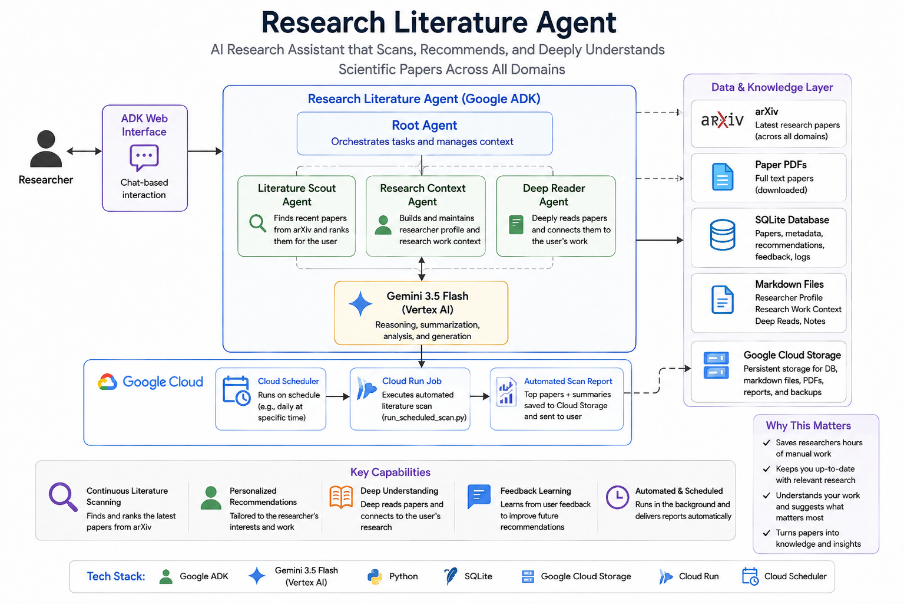

# Architecture

The system separates language-model judgment from deterministic retrieval and storage.

## Agent layer

- **Root coordinator** — presents one user-facing assistant and routes tasks internally.
- **Literature Scout** — arXiv discovery, personalized ranking, saves, author search, and feedback.
- **Research Context** — editable interests, bookmark-based inference, work context, and own publications.
- **Deep Reader** — explicit full-paper PDF analysis and persistent deep-read results.

All three agents use **Gemini 3.5 Flash through Vertex AI** and are orchestrated with **Google ADK**.

## Deterministic tools

Python tools handle arXiv API access, identifier normalization, SQLite persistence, Markdown edits, PDF download/text extraction, and Google Cloud Storage synchronization. Deterministic work is kept outside model reasoning wherever possible.

## Persistence

The local application uses SQLite plus Markdown files. When `RESEARCH_AGENT_GCS_BUCKET` is configured, mutable state is restored from and synchronized to Google Cloud Storage so state survives Cloud Run instance replacement.

## Automation

A Cloud Run Job executes `run_scheduled_scan.py`. Cloud Scheduler invokes that job on a recurring schedule, producing timestamped literature reports that are persisted to Cloud Storage.
